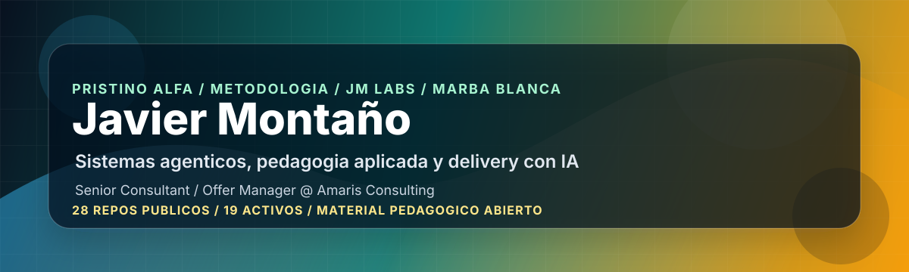

  

  

<h1 align="center">Javier Montaño</h1>

<strong>Founder & Empowerment Officer @ MetodologIA | Pristino Author | Senior Consultant / Offer Manager @ Amaris Consulting</strong>

  
  
  
  
  
  
  

  
  
  
  
  
  

  
  
  
  

## Convierto retos en oportunidades y oportunidades en casos de exito

**Method first, AI next.** Construyo repos, playbooks, agentes, prompts, cursos y artefactos para que los retos no se queden en diagnosticos y las oportunidades no se queden en intenciones. Mi campo de accion cruza **consultoria**, **operaciones**, **management**, **adopcion de IA** y **disrupcion digital**: pasar de **reto a oportunidad**, de **oportunidad a metodo**, de **metodo a sistema**, y de **sistema a caso de exito verificable**.

Primero, soy **Founder & Empowerment Officer en MetodologIA**. En mi rol profesional actual soy **Senior Consultant / Offer Manager en Amaris Consulting**. Mis lineas propias se separan en **MetodologIA** para metodo abierto, **Mamba** para consultoria aplicada y **JM Labs** para experimentacion. Trabajo con **OpenAI Codex** como runtime de ejecucion agentica para convertir contexto, repos y decisiones en entregables verificables.

## Escala publica verificable

| Capa | Estado publico | Que significa |
|---|---:|---|
| **Repos publicos** | **27** | Superficie visible en GitHub para productos, material, plugins, experimentos y perfil |
| **Repos activos no fork/no archivados** | **18** | Parte viva del ecosistema publico actual |
| **Material pedagogico abierto** | **4 frentes** | Trabajo Amplificado, Material Educativo, Prompt Amplificado y Discovery de Producto |
| **Pristino / agentic systems** | **Beta privado** | [Pristino Beta](https://github.com/JaviMontano/jm-adk-beta) es la linea principal, sin exponer tracks anteriores |
| **MetodologIA / MAO plugins** | **varios repos publicos** | Discovery, SDD, IIC, Plugin QA, PM APEX, Sovereign Architect y Scriba |

No vendo esta tabla como un inventario total. Es la parte publica, legible y enlazable de un sistema de trabajo mas amplio.

## Que ya esta vivo

| Sistema | Que hace | Estado |
|---|---|---|
| [**Pristino Beta**](https://github.com/JaviMontano/jm-adk-beta) | Harness privado orientado a catalogos, vibe coders y knowledge workers AI-native | Privado / linea principal |
| [**trabajar-amplificado**](https://github.com/JaviMontano/trabajar-amplificado) | Bootcamp para managers con Claude Cowork y MetodologIA, con material ES/EN/PT | Publico / pedagogico |
| [**Cartilla Aprender, Aprehender y Revolucionar**](https://github.com/JaviMontano/material-educativo-metodologia/blob/main/playbook-aprender-aprehender-revolucionar-2026.html) | Guia HTML para aprender a aprender, transferir conocimiento y usar IA con metodo | Publico / cartilla |
| [**Conocer a Javier / Dashboard**](https://javimontano.github.io/JaviMontano/) | GitHub Page full brand con CV publico, ecosistema, kanban de tareas, procedimientos y productividad | Publico / dashboard |
| [**Recursos MetodologIA**](https://metodologia.info/recursos/) | Hub publico de GPTs, Gems y NotebookLM para navegar recursos IA de MetodologIA | Publico / recursos |
| [**material-educativo-metodologia**](https://github.com/JaviMontano/material-educativo-metodologia) | Repo de recursos pedagogicos, cartillas, playbooks y skills educativas | Publico / educativo |
| [**prompt-amplificado**](https://github.com/JaviMontano/prompt-amplificado) | Ingenieria de prompts, contexto y arneses para trabajar con IA | Publico / metodologia |
| [**mao-discovery-framework**](https://github.com/JaviMontano/mao-discovery-framework) | Framework publico de discovery para profesionales de la era IA | Publico / MAO |
| [**mao-sdd**](https://github.com/JaviMontano/mao-sdd) | Spec Driven Development aplicado al desarrollo con IA | Publico / plugin |
| [**playbook-forge**](https://github.com/JaviMontano/playbook-forge) | Generador de playbooks HTML con marca y flujos AI-native | Publico / artifact engine |

## Lo que estoy construyendo ahora

### Pristino Beta

La linea principal de Pristino se mueve a Beta: un harness privado, orientado por catalogos, para convertir repos en sistemas operables. Beta concentra el trabajo de leer contexto, rutear decisiones, ejecutar con herramientas, validar resultados y cerrar con evidencia.

### MetodologIA como pedagogia abierta

Materiales, bootcamps, prompts, playbooks y guias que ayudan a equipos y profesionales a operar **method first, AI next**: primero criterio, ruta y evidencia; despues herramientas, modelos y automatizacion. La ruta principal empieza en la [Cartilla Aprender, Aprehender y Revolucionar](https://github.com/JaviMontano/material-educativo-metodologia/blob/main/playbook-aprender-aprehender-revolucionar-2026.html) y continua en el [hub de recursos de MetodologIA](https://metodologia.info/recursos/).

### Consultoria aplicada en Amaris Consulting

Trabajo en contextos reales de oferta, habilitacion y adopcion de IA. La clave no es prometer automatizacion: es leer retos, detectar oportunidades, estructurar valor, aterrizar delivery y dejar sistemas repetibles.

### Mamba como consultoria propia

Mamba es la linea consultiva para empaquetar estrategia, IA, operaciones y gestion en servicios, activos y propuestas que una organizacion puede entender, comprar y ejecutar.

### JM Labs como laboratorio

JM Labs es mi laboratorio de exploracion: pruebo agentes, prompts, repos, automatizaciones y flujos de trabajo hasta convertir aprendizaje tecnico en prototipos reutilizables.

## Superficies que domino

- **Trabajo agentico y orquestacion:** agentes, asistentes y subagentes con roles separados para estrategia, ejecucion, soporte y guardiania.
- **SDLC deterministico con IA:** especificaciones, criterios de aceptacion, validadores, pruebas, trazabilidad y gates para llevar salidas probabilisticas a software y artefactos auditables.
- **Segundos cerebros y digital twins:** bases de conocimiento, notebooks, repos y mapas de contexto que convierten conocimiento tacito en sistemas navegables.
- **Skills, prompts y plugins:** capacidades reutilizables con instrucciones, contexto minimo, plantillas, fuentes y criterios de salida.
- **Prototipado hiper acelerado:** pasar de boceto a prototipo funcional, mini app, dashboard o HTML publicable para validar hipotesis de negocio.
- **Gestion consultiva y cambio:** discovery, ofertas, preventa, adopcion de IA, enablement, transferencia y operacion.
- **Material pedagogico:** cursos, bootcamps, playbooks, guias y artefactos compartibles para que otros aprendan a operar con metodo.

## Rutas y repositorios clave

| Linea | Repos |
|---|---|
| **Pristino** | [Pristino Beta](https://github.com/JaviMontano/jm-adk-beta) (privado) |
| **Material pedagogico** | [Cartilla Aprender, Aprehender y Revolucionar](https://github.com/JaviMontano/material-educativo-metodologia/blob/main/playbook-aprender-aprehender-revolucionar-2026.html) [Recursos MetodologIA](https://metodologia.info/recursos/) [material-educativo-metodologia](https://github.com/JaviMontano/material-educativo-metodologia) [trabajar-amplificado](https://github.com/JaviMontano/trabajar-amplificado) [prompt-amplificado](https://github.com/JaviMontano/prompt-amplificado) [discovery-producto](https://github.com/JaviMontano/discovery-producto) |
| **MetodologIA / MAO** | [mao-discovery-framework](https://github.com/JaviMontano/mao-discovery-framework) [mao-sdd](https://github.com/JaviMontano/mao-sdd) [mao-iic](https://github.com/JaviMontano/mao-iic) [mao-plugin-qa](https://github.com/JaviMontano/mao-plugin-qa) [mao-pm-apex](https://github.com/JaviMontano/mao-pm-apex) [mao-sovereign-architect](https://github.com/JaviMontano/mao-sovereign-architect) |
| **Artefactos y casos** | [playbook-forge](https://github.com/JaviMontano/playbook-forge) [mao-scriba](https://github.com/JaviMontano/mao-scriba) [jm-nexus-deep-dive](https://github.com/JaviMontano/jm-nexus-deep-dive) [metodologia-campana-ecuador-1](https://github.com/JaviMontano/metodologia-campana-ecuador-1) |

## Principios operativos

- **Evidencia antes que velocidad:** si una afirmacion importa, debe poder rastrearse.
- **Method first, AI next:** primero metodo, criterio y evidencia; luego IA, herramientas y automatizacion.
- **Pedagogia antes que dependencia:** un buen sistema debe poder explicarse y transferirse.
- **Delivery antes que vitrina:** el artefacto debe poder probarse, usarse o mantenerse.
- **Marca con frontera:** Amaris es mi contexto profesional actual; Mamba, MetodologIA y JM Labs son mis lineas propias.

## Herramientas y sistemas de trabajo

**AI workbench** 
OpenAI Codex | Claude Code | Claude Desktop | ChatGPT | Claude | Gemini | Copilot | Perplexity | DeepSeek | Kimi | Grok | NotebookLM

**Agentic engineering & automation** 
Pristino Beta | Antigravity | n8n | Make | Zapier | OpenAI Agents SDK | Promster | prompts | skills | plugins | workflows multiagente | RAG operativo

**Knowledge, collaboration & governance** 
Google Drive | Google Workspace | Google Meet | Microsoft 365 | Notion | Obsidian | Miro | Mermaid | GitHub | Campus | source ledgers | context routers | quality gates | validators

**Product, UI & media prototyping** 
Google Stitch | Google AI Studio | V0 by Vercel | Vercel | Hostinger | Figma | Canva | Napkin AI | Gamma | ElevenLabs | Leonardo AI | Powtoon | SketchNow | Pomeli | Nano Banana | HTML artifacts | dashboards | mini apps

**Methods & delivery patterns** 
BMAD | IIKit / IKIIT | Spec Driven Development | agile/lean | Design Thinking | PARA | Zettelkasten | SOPs | OKRs | change plans | digital culture blueprints | capstones | innovation labs

## Capacidades que capitalizo

| Capacidad | Impacto legible para negocio |
|---|---|
| **Retos a oportunidades; oportunidades a casos de exito** | Leo restricciones, dolores y fricciones como materia prima de valor; despues los convierto en casos de uso, ofertas, pilotos, sistemas y evidencia de avance. |
| **SDLC deterministico con IA** | Convierto intencion, contexto y prompts en specs, arquitectura, pruebas, validadores y gates para que el desarrollo con IA sea trazable, repetible y menos dependiente de improvisacion. |
| **Aceleracion del SDLC con Trabajo Agentico** | Uso agentes y asistentes para reducir friccion entre discovery, diseno, desarrollo, QA, documentacion y cierre, sin perder criterio tecnico ni control humano. |
| **BMAD e IIKit / IKIIT** | Adapto patrones de Agile AI Driven Development, cadenas Intent-to-Spec, roles especializados, debate multiperspectiva y readiness gates a contextos reales de producto, procesos y consultoria. |
| **Segundos cerebros y digital twins** | Transformo conocimiento disperso en notebooks, bases RAG, repos gobernados y digital twins de conocimiento u operacion para que equipos recuperen contexto, aprendan y decidan mejor. |
| **Prototipado hiper acelerado** | Paso de bocetos y oportunidades a prototipos funcionales, mini apps, dashboards o artefactos HTML en ciclos cortos para validar hipotesis antes de comprometer inversion grande. |
| **Gestion del cambio y adopcion de IA** | Diseno rutas de adopcion, champions, rituales, playbooks, OKRs y planes de habilitacion para que la IA se vuelva capacidad instalada, no demostracion aislada. |
| **Transformacion y disrupcion digital** | Redisenio procesos, sistemas de trabajo y modelos de decision para capturar oportunidades digitales antes de que se vuelvan urgencias competitivas. |
| **Operations & management** | Conecto accountability, agilidad, Lean, SOPs, dashboards y gobierno de decisiones para que estrategia, preventa y delivery operen con mayor claridad. |
| **Pedagogia y empowerment** | Creo programas, cartillas y experiencias de aprendizaje donde la IA aumenta agencia humana, practica deliberada y transferencia, no dependencia. |

## Trayectoria

- **MetodologIA** - Founder & Empowerment Officer 
  Construyo metodologia abierta, comunidad, frameworks, programas y cartillas para que profesionales y equipos aprendan IA con criterio, conviertan conocimiento en practicas transferibles y ganen autonomia operativa.

- **Amaris Consulting** - Senior Consultant / Offer Manager 
  Conecto estrategia, preventa y delivery para convertir necesidades de negocio en ofertas claras, casos de uso priorizados y planes de adopcion de IA que equipos tecnicos, comerciales y de gestion pueden entender, vender y ejecutar.

- **Mamba** - consultoria propia 
  Traduzco criterio de gestion, IA y operaciones en servicios consultivos, ofertas y activos de trabajo que ayudan a organizaciones a pasar de intencion estrategica a ejecucion repetible.

- **JM Labs** - laboratorio propio 
  Exploro sistemas agenticos, prompts, automatizacion y repos gobernados para convertir experimentos tecnicos en aprendizajes, prototipos y capacidades reutilizables.

- **Tech and Solve** - experiencia previa 
  Lidere proyectos y transformacion digital con equipos multidisciplinarios, conectando agilidad, coordinacion operativa y delivery para ordenar prioridades y mejorar ejecucion.

- **Clinica Pajonal** - experiencia previa 
  Dirigi transformacion digital, procesos y operaciones en salud, con foco en modelo paperless, calidad, habilitacion regulatoria y mejoras organizacionales medibles.

## Conversemos

Si quieres hablar de **sistemas agenticos, SDLC deterministico, segundos cerebros, digital twins, IA aplicada a delivery, oferta consultiva, pedagogia o prototipado hiper acelerado**, este perfil te deja las rutas principales:

  <a href="https://metodologia.info">metodologia.info</a>
  |
  <a href="https://github.com/JaviMontano/jm-adk-beta">Pristino Beta</a>
  |
  <a href="https://javimontano.github.io/JaviMontano/">Conocer a Javier</a>
  |
  <a href="https://github.com/JaviMontano/material-educativo-metodologia/blob/main/playbook-aprender-aprehender-revolucionar-2026.html">Cartilla Aprender a Aprender</a>
  |
  <a href="https://metodologia.info/recursos/">Recursos MetodologIA</a>
  |
  <a href="https://github.com/JaviMontano/trabajar-amplificado">Trabajo Amplificado</a>
  |
  <a href="https://github.com/JaviMontano/material-educativo-metodologia">Material educativo</a>
  |
  <a href="https://co.linkedin.com/in/javier-andr%C3%A9s-monta%C3%B1o-guzm%C3%A1n-35b02756/en">LinkedIn</a>

