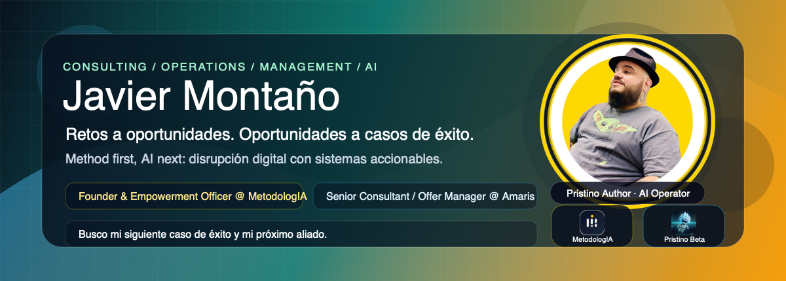

  

  
  
  
  
  
  
  

  
  
  
  
  
  

  
  
  
  

## Convierto retos en oportunidades y oportunidades en casos de éxito

**Method first, AI next.** Construyo repos, playbooks, agentes, prompts, cursos y artefactos para que los retos no se queden en diagnósticos y las oportunidades no se queden en intenciones. Mi campo de acción cruza **consultoría**, **operaciones**, **management**, **adopción de IA** y **disrupción digital**: pasar de **reto a oportunidad**, de **oportunidad a método**, de **método a sistema**, y de **sistema a caso de éxito verificable**.

Primero, soy **Founder & Empowerment Officer @ MetodologIA** y **Pristino Author**. En mi rol profesional actual soy **Senior Consultant / Offer Manager Data & IA @ Amaris Consulting**. Mis líneas propias se separan en **MetodologIA** para método abierto, **Mamba Blanca** para desarrollo de assets digitales y **JM Labs** para experimentación. Trabajo con **OpenAI Codex** como runtime de ejecución agéntica para convertir contexto, repos y decisiones en entregables verificables.

## Lo que ya está vivo

| Sistema | Qué hace | Estado |
|---|---|---|
| [**Pristino Beta**](https://github.com/JaviMontano/jm-adk-beta) | Harness público orientado a catálogos, vibe coders y knowledge workers AI-native | Público / beta |
| [**NotebookLM Empoderamiento en IA y Método**][notebook-empoderamiento] | Notebook vivo para estudiar, conectar fuentes y navegar el programa de empoderamiento con método | Público / NotebookLM |
| [**trabajar-amplificado**](https://github.com/JaviMontano/trabajar-amplificado) | Bootcamp para managers con Claude Cowork y MetodologIA, con material ES/EN/PT | Público / pedagógico |
| [**Cartilla Aprender, Aprehender y Revolucionar**](https://github.com/JaviMontano/material-educativo-metodologia/blob/main/playbook-aprender-aprehender-revolucionar-2026.html) | Guía HTML para aprender a aprender, transferir conocimiento y usar IA con método | Público / cartilla |
| [**Conocer a Javier / Dashboard**](https://javimontano.github.io/JaviMontano/) | GitHub Page full brand con CV público, ecosistema, kanban de tareas, procedimientos y productividad | Público / dashboard |
| [**Recursos MetodologIA**](https://metodologia.info/recursos/) | Hub público de GPTs, Gems y NotebookLM para navegar recursos IA de MetodologIA | Público / recursos |
| [**material-educativo-metodologia**](https://github.com/JaviMontano/material-educativo-metodologia) | Repo de recursos pedagógicos, cartillas, playbooks y skills educativas | Público / educativo |
| [**Biblioteca Universal de Prompts**](https://javimontano.github.io/prompt-amplificado/) | Ingeniería de prompts, contexto y arneses para trabajar con IA | Público / GitHub Page |

## Lo que estoy construyendo ahora

### Pristino Beta

Pristino Beta ya está público: es un harness orientado por catálogos para convertir repos en sistemas operables. Concentra el trabajo de leer contexto, rutear decisiones, ejecutar con herramientas, validar resultados y cerrar con evidencia.

### MetodologIA como pedagogía abierta

Materiales, bootcamps, prompts, playbooks y guías que ayudan a equipos y profesionales a operar **method first, AI next**: primero criterio, ruta y evidencia; después herramientas, modelos y automatización. La ruta principal empieza en la [Cartilla Aprender, Aprehender y Revolucionar](https://github.com/JaviMontano/material-educativo-metodologia/blob/main/playbook-aprender-aprehender-revolucionar-2026.html) y continúa en el [hub de recursos de MetodologIA](https://metodologia.info/recursos/).

### Consultoría aplicada en Amaris Consulting

Trabajo como consultor Data & IA y Offer Manager enfocado en disrupción digital. Leo retos de negocio, detecto oportunidades, estructuro valor, aterrizo delivery y convierto la adopción de IA en rutas con victorias tempranas, continuas y medibles.

He trabajado con audiencias y organizaciones que van desde freelancers y emprendedores hasta empresas gubernamentales y corporativos multinacionales con presencia en bolsa. Mi base más fuerte está en banca, seguros y servicios financieros, con experiencia adicional en retail, grandes superficies y salud.

### Mamba Blanca como consultora propia

Mamba Blanca es mi consultora propia para desarrollar assets digitales: playbooks, dashboards, mini apps, sitios, sistemas de conocimiento y artefactos de IA que una organización puede entender, usar y evolucionar.

### JM Labs como laboratorio

JM Labs es mi laboratorio de exploración: pruebo agentes, prompts, repos, automatizaciones y flujos de trabajo hasta convertir aprendizaje técnico en prototipos reutilizables.

## Superficies que domino

- **Trabajo agéntico y orquestación:** agentes, asistentes y subagentes con roles separados para estrategia, ejecución, soporte y guardianía.
- **SDLC determinístico con IA:** especificaciones, criterios de aceptación, validadores, pruebas, trazabilidad y gates para llevar salidas probabilísticas a software y artefactos auditables.
- **Segundos cerebros y digital twins:** bases de conocimiento, notebooks, repos y mapas de contexto que convierten conocimiento tácito en sistemas navegables.
- **Skills, prompts y plugins:** capacidades reutilizables con instrucciones, contexto mínimo, plantillas, fuentes y criterios de salida.
- **Prototipado hiper acelerado:** pasar de boceto a prototipo funcional, mini app, dashboard o HTML publicable para validar hipótesis de negocio.
- **Gestión consultiva Data & IA:** discovery, ofertas, preventa, disrupción digital, adopción de IA, enablement, transferencia y operación.
- **Material pedagógico:** cursos, bootcamps, playbooks, guías y artefactos compartibles para que otros aprendan a operar con método.

## Rutas y repositorios clave

| Línea | Repos |
|---|---|
| **Pristino** | [Pristino Beta](https://github.com/JaviMontano/jm-adk-beta) (público / beta) |
| **Material pedagógico** | [NotebookLM Empoderamiento en IA y Método][notebook-empoderamiento] [Cartilla Aprender, Aprehender y Revolucionar](https://github.com/JaviMontano/material-educativo-metodologia/blob/main/playbook-aprender-aprehender-revolucionar-2026.html) [Recursos MetodologIA](https://metodologia.info/recursos/) [material-educativo-metodologia](https://github.com/JaviMontano/material-educativo-metodologia) [trabajar-amplificado](https://github.com/JaviMontano/trabajar-amplificado) [Biblioteca Universal de Prompts](https://javimontano.github.io/prompt-amplificado/) [discovery-producto](https://github.com/JaviMontano/discovery-producto) |
| **MetodologIA / MAO** | [mao-iic](https://github.com/JaviMontano/mao-iic) [mao-plugin-qa](https://github.com/JaviMontano/mao-plugin-qa) [mao-pm-apex](https://github.com/JaviMontano/mao-pm-apex) [mao-sovereign-architect](https://github.com/JaviMontano/mao-sovereign-architect) |
| **Artefactos y casos** | [mao-scriba](https://github.com/JaviMontano/mao-scriba) [jm-nexus-deep-dive](https://github.com/JaviMontano/jm-nexus-deep-dive) [metodologia-campana-ecuador-1](https://github.com/JaviMontano/metodologia-campana-ecuador-1) |

## Principios operativos

- **Evidencia antes que velocidad:** si una afirmación importa, debe poder rastrearse.
- **Method first, AI next:** primero método, criterio y evidencia; luego IA, herramientas y automatización.
- **Pedagogía antes que dependencia:** un buen sistema debe poder explicarse y transferirse.
- **Delivery antes que vitrina:** el artefacto debe poder probarse, usarse o mantenerse.
- **Marca con frontera:** Amaris es mi contexto profesional actual; Mamba Blanca, MetodologIA y JM Labs son mis líneas propias.

## Método y estilo de intervención

Uso **P.I.V.O.T.E.** como lente de intervención: **Personas, Interacciones, Valor, Organización, Tecnología y Evolución**. Primero entiendo el sistema de trabajo real; luego cocreo o mejoro el método, reduzco fricción, identifico puntos de automatización y decido si conviene un prompt simple, una plantilla, un asistente, un workflow, una automatización o delegación agéntica. La IA entra cuando hay criterio, reglas y evidencia para amplificar con control y claridad. [Ver método completo](https://metodologia.info/vision/).

## Herramientas y sistemas de trabajo

**AI workbench** 
OpenAI Codex | Claude Code | Claude Desktop | ChatGPT | Claude | Gemini | Copilot | Perplexity | DeepSeek | Kimi | Grok | NotebookLM

**Agentic engineering & automation** 
Pristino Beta | Antigravity | n8n | Make | Zapier | OpenAI Agents SDK | Prompster | Text Expanders | Bibliotecas de Prompts | skills | plugins | workflows multiagente | RAG operativo

**Knowledge, collaboration & governance** 
Google Drive | Google Workspace | Google Meet | Microsoft 365 | Notion | Obsidian | Miro | Mermaid | GitHub | Campus | source ledgers | context routers | quality gates | validators

**Product, UI & media prototyping** 
Google Stitch | Google AI Studio | V0 by Vercel | Vercel | Hostinger | Figma | Canva | Napkin AI | Gamma | ElevenLabs | Lovable | Powtoon | SketchNow | Pomeli | Nano Banana | HTML artifacts | dashboards | mini apps

**Methods & delivery patterns** 
BMAD | IIKit / IKIIT | Spec Driven Development | agile/lean | Design Thinking | PIVOTE | Zettelkasten | SOPs | OKRs | change plans | digital culture blueprints | capstones | innovation labs

## Capacidades que capitalizo

| Capacidad | Impacto legible para negocio |
|---|---|
| **Retos a oportunidades; oportunidades a casos de éxito** | Leo restricciones, dolores y fricciones como materia prima de valor; después los convierto en casos de uso, ofertas, pilotos, sistemas y evidencia de avance. |
| **SDLC determinístico con IA** | Convierto intención, contexto y prompts en specs, arquitectura, pruebas, validadores y gates para que el desarrollo con IA sea trazable, repetible y menos dependiente de improvisación. |
| **Aceleración del SDLC con Trabajo Agéntico** | Uso agentes y asistentes para reducir fricción entre discovery, diseño, desarrollo, QA, documentación y cierre, sin perder criterio técnico ni control humano. |
| **BMAD e IIKit / IKIIT** | Adapto patrones de Agile AI Driven Development, cadenas Intent-to-Spec, roles especializados, debate multiperspectiva y readiness gates a contextos reales de producto, procesos y consultoría. |
| **Segundos cerebros y digital twins** | Transformo conocimiento disperso en notebooks, bases RAG, repos gobernados y digital twins de conocimiento u operación para que equipos recuperen contexto, aprendan y decidan mejor. |
| **Prototipado hiper acelerado** | Paso de bocetos y oportunidades a prototipos funcionales, mini apps, dashboards o artefactos HTML en ciclos cortos para validar hipótesis antes de comprometer inversión grande. |
| **Gestión del cambio y adopción de IA** | Diseño rutas de adopción, champions, rituales, playbooks, OKRs y planes de habilitación para que la IA se vuelva capacidad instalada, no demostración aislada. |
| **Transformación y disrupción digital** | Rediseño procesos, sistemas de trabajo y modelos de decisión para capturar oportunidades digitales antes de que se vuelvan urgencias competitivas. |
| **Operations & management** | Conecto accountability, agilidad, Lean, SOPs, dashboards y gobierno de decisiones para que estrategia, preventa y delivery operen con mayor claridad. |
| **Pedagogía y empowerment** | Creo programas, cartillas y experiencias de aprendizaje donde la IA aumenta agencia humana, práctica deliberada y transferencia real: que el equipo entienda, adapte y sostenga el método sin depender del facilitador o de una herramienta específica. |

## Trayectoria

- **MetodologIA** - Founder & Empowerment Officer 
  Construyo metodología abierta, comunidad, frameworks, programas y cartillas para que profesionales y equipos aprendan IA con criterio, conviertan conocimiento en prácticas transferibles y ganen autonomía operativa.

- **Pristino Beta** - Author / public harness 
  Desarrollo un harness público para sistemas agénticos, procedimientos, validadores y trabajo asistido por repos.

- **Mamba Blanca** - consultora propia para assets digitales 
  Desarrollo playbooks, dashboards, mini apps, sitios, sistemas de conocimiento y artefactos de IA que convierten estrategia, método y aprendizaje en activos digitales reutilizables.

- **JM Labs** - laboratorio propio 
  Exploro sistemas agénticos, prompts, automatización y repos gobernados para convertir experimentos técnicos en aprendizajes, prototipos y capacidades reutilizables.

- **Amaris Consulting** - Senior Consultant / Offer Manager Data & IA 
  Conecto estrategia, preventa, delivery y disrupción digital para convertir necesidades de negocio en ofertas claras, casos de uso priorizados y planes de adopción de IA que equipos técnicos, comerciales y de gestión pueden entender, vender y ejecutar. Trabajo con foco fuerte en banca, seguros y servicios financieros, y con experiencia en retail, grandes superficies, salud, organizaciones públicas y corporativos multinacionales.

- **Sofka Technologies** - experiencia previa 
  Fui GenAI Champion y PreSales Architect, conectando transformación, preventa, liderazgo regional y adopción de IA para convertir capacidades técnicas en ofertas, habilitación y casos de negocio comprensibles.

- **Tech and Solve** - experiencia previa 
  Lideré proyectos y transformación digital con equipos multidisciplinarios, conectando agilidad, coordinación operativa y delivery para ordenar prioridades y mejorar ejecución.

- **Clínica Pajonal** - experiencia previa 
  Dirigí transformación digital, procesos y operaciones en salud, con foco en modelo paperless, calidad, habilitación regulatoria y mejoras organizacionales medibles.

## Conversemos

Busco mi siguiente caso de éxito y mi próximo aliado: una organización, equipo o líder con un reto real que pueda convertirse en oportunidad, método, sistema y resultado visible. Si al leer este perfil sientes que puedes ser ese aliado, conversemos.

  <a href="mailto:contacto@metodologia.info">contacto@metodologia.info</a>
  |
  <a href="https://metodologia.info">metodologia.info</a>
  |
  <a href="https://co.linkedin.com/in/javier-andr%C3%A9s-monta%C3%B1o-guzm%C3%A1n-35b02756/en">LinkedIn</a>
  |
  <a href="https://metodologia.info/recursos/">Recursos MetodologIA</a>
  |
  <a href="https://notebooklm.google.com/notebook/9fdf2de1-9d2f-40ec-a365-e00a4f444e51/artifact/5e28154c-8bfa-4364-b5f0-df9a44a57e98?utm_source=nlm_web_share&amp;utm_medium=google_oo&amp;utm_campaign=art_share_1&amp;utm_content=&amp;utm_smc=nlm_web_share_google_oo_art_share_1_">NotebookLM Empoderamiento</a>
  |
  <a href="https://javimontano.github.io/JaviMontano/">Conocer a Javier</a>
  |
  <a href="https://github.com/JaviMontano/jm-adk-beta">Pristino Beta</a>
  |
  <a href="https://github.com/JaviMontano/material-educativo-metodologia/blob/main/playbook-aprender-aprehender-revolucionar-2026.html">Cartilla Aprender a Aprender</a>
  |
  <a href="https://github.com/JaviMontano/trabajar-amplificado">Trabajo Amplificado</a>
  |
  <a href="https://github.com/JaviMontano/material-educativo-metodologia">Material educativo</a>

[notebook-empoderamiento]: https://notebooklm.google.com/notebook/9fdf2de1-9d2f-40ec-a365-e00a4f444e51/artifact/5e28154c-8bfa-4364-b5f0-df9a44a57e98?utm_source=nlm_web_share&utm_medium=google_oo&utm_campaign=art_share_1&utm_content=&utm_smc=nlm_web_share_google_oo_art_share_1_
